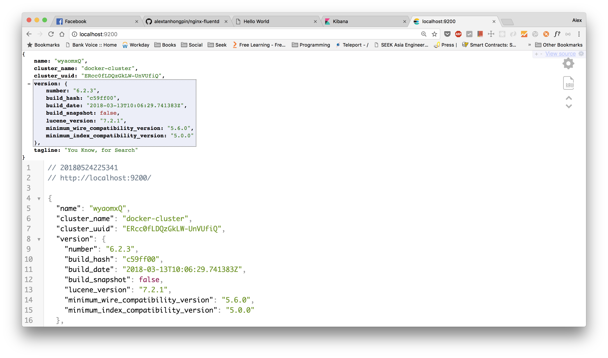
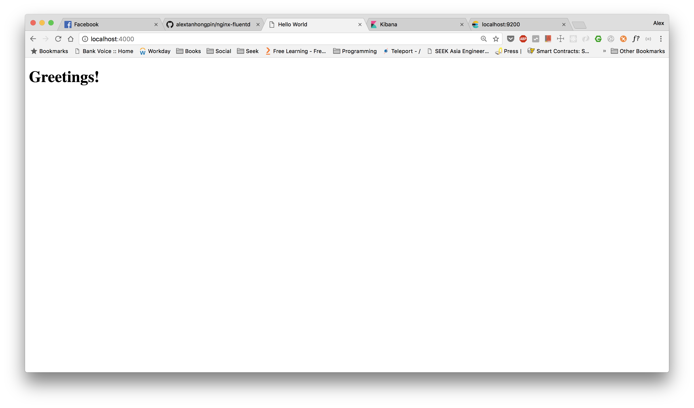
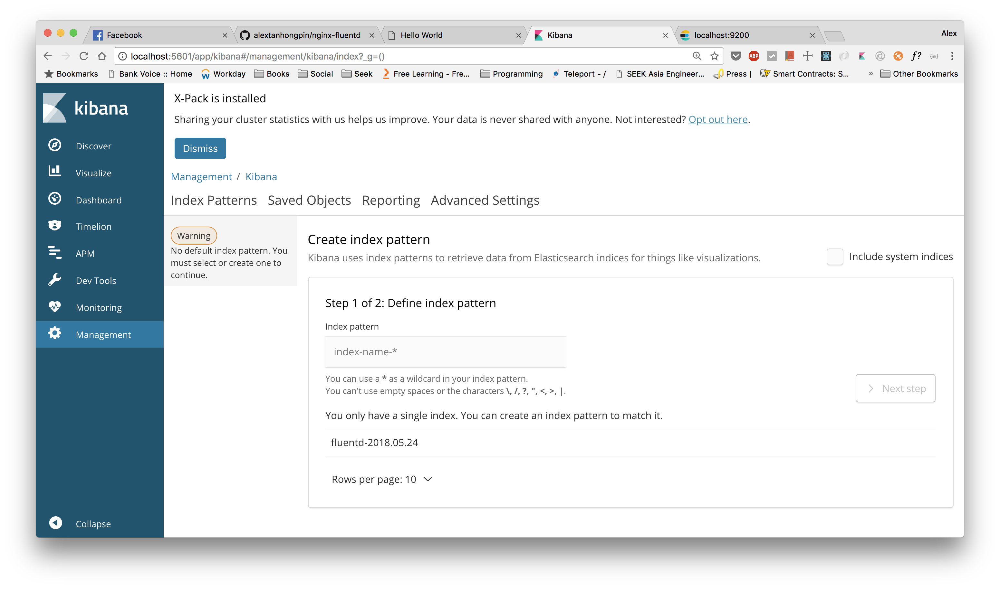
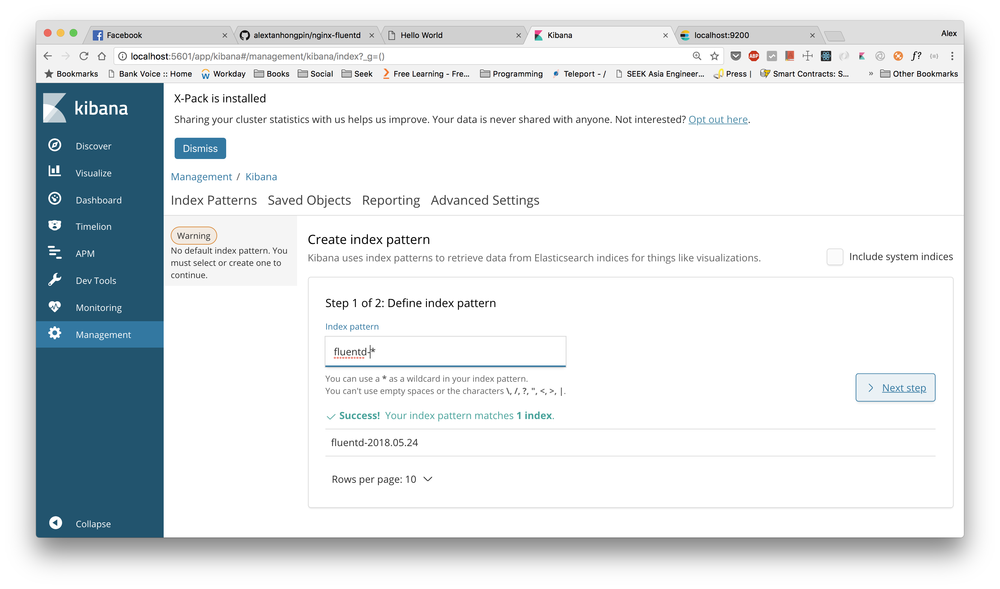
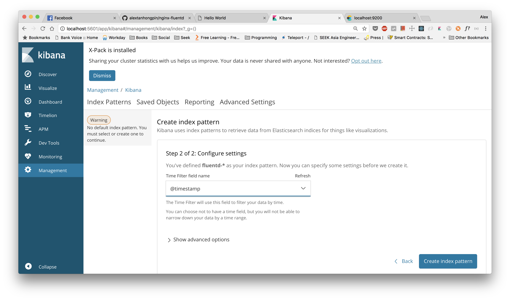
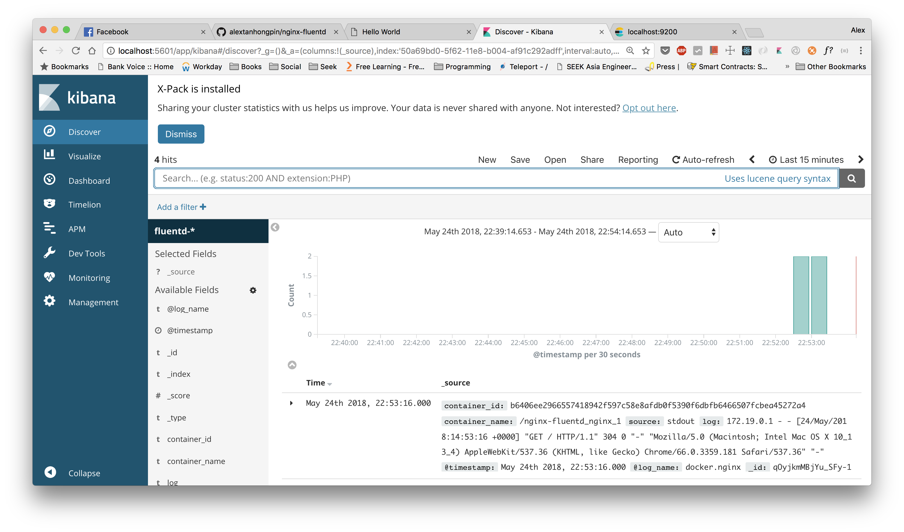

# nginx-fluentd

Nginx serving a single html file in the `nginx` folder and delivers the logs to Kibana through fluentd logging driver.

## Build

The fluentd image is hosted in __Dockerhub__ as `alextanhongpin/fluentd`. In case you need build one yourself:

```bash
# Go to the directory that contains the Dockerfile
$ cd fluentd

# Run the docker build
$ docker build -t alextanhongpin/fluentd .
```

## Start

```bash
$ docker-compose up -d
```

Output:

```
WARNING: The Docker Engine you're using is running in swarm mode.

Compose does not use swarm mode to deploy services to multiple nodes in a swarm. All containers will be scheduled on the current node.

To deploy your application across the swarm, use `docker stack deploy`.

Creating network "nginx-fluentd_default" with the default driver
Creating nginx-fluentd_kibana_1        ... done
Creating nginx-fluentd_fluentd_1       ... done
Creating nginx-fluentd_elasticsearch_1 ... done
Creating nginx-fluentd_nginx_1         ... done
```

## View running images

```bash
$ docker ps
```

Output:

```
CONTAINER ID        IMAGE                                                 COMMAND                  CREATED             STATUS              PORTS                                                              NAMES
b6406ee29665        nginx:1.13.12                                         "nginx -g 'daemon of…"   3 seconds ago       Up 2 seconds        127.0.0.1:4000->80/tcp                                             nginx-fluentd_nginx_1
667535c681e4        docker.elastic.co/elasticsearch/elasticsearch:6.2.3   "/usr/local/bin/dock…"   4 seconds ago       Up 3 seconds        127.0.0.1:9200->9200/tcp, 127.0.0.1:9300->9300/tcp                 nginx-fluentd_elasticsearch_1
1ae6444d3f90        alextanhongpin/fluentd                                "/bin/entrypoint.sh …"   4 seconds ago       Up 3 seconds        5140/tcp, 127.0.0.1:24224->24224/tcp, 127.0.0.1:24224->24224/udp   nginx-fluentd_fluentd_1
211a5007efa4        docker.elastic.co/kibana/kibana:6.2.3                 "/bin/bash /usr/loca…"   4 seconds ago       Up 3 seconds        127.0.0.1:5601->5601/tcp                                           nginx-fluentd_kibana_1
```

## View Elasticsearch

Open [localhost:9200](localhost:9200):



## View Nginx Static HTML

Open [localhost:4000](localhost:4000):



## View Kibana Logs

Open [localhost:5601](localhost:5601):



Create log index:





View logs:



## Stop

```bash
$ docker-compose down
```

Output:

```bash
Stopping nginx-fluentd_nginx_1         ... done
Stopping nginx-fluentd_elasticsearch_1 ... done
Stopping nginx-fluentd_fluentd_1       ... done
Stopping nginx-fluentd_kibana_1        ... done
Removing nginx-fluentd_nginx_1         ... done
Removing nginx-fluentd_elasticsearch_1 ... done
Removing nginx-fluentd_fluentd_1       ... done
Removing nginx-fluentd_kibana_1        ... done
Removing network nginx-fluentd_default
```

## TODO

- [] Fix local minikube and setup kubernetes version